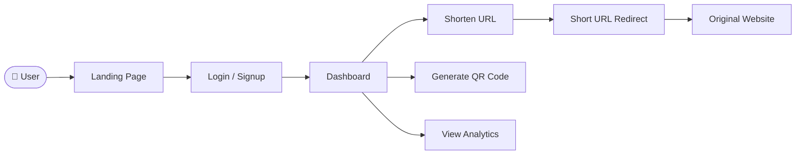
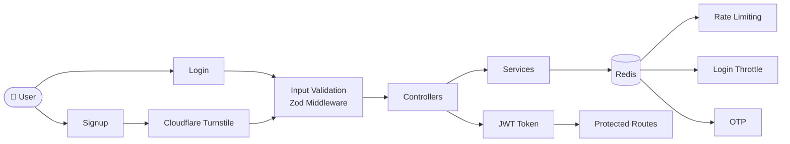
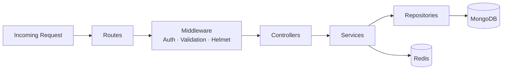
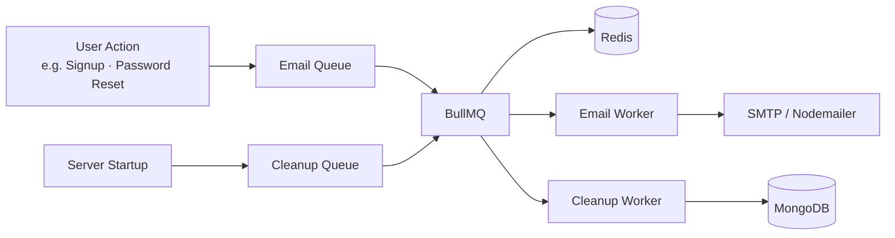

# 🔗 LinkForge

<div align="center">


### A Production-Ready URL Management Platform

Built with high-performance Node.js, TypeScript, Redis, BullMQ and modern security best practices.

<p align="center">
  <a href="https://github.com/bishalProMax/LinkForge/issues">
    
  </a>
  <a href="https://github.com/bishalProMax/LinkForge/pulls">
    
  </a>
  <a href="https://github.com/bishalProMax/LinkForge/blob/main/LICENSE">
    
  </a>
</p>

</div>

---

## 🚀 Overview

LinkForge is a production-ready URL shortening and management platform built with TypeScript, Express.js, MongoDB, Redis, and BullMQ. Users can create short URLs, generate QR codes, and monitor link activity through a modern dashboard.

---

## ✨ Features

- **🔗 URL Shortening & Management**: Create, organize and manage short URLs through a centralized dashboard.
- **📱 QR Code Generation**: Generate QR codes instantly, download them as PNG files, and share them directly from the browser.
- **📊 URL Analytics**: Track clicks and monitor link activity with IP logging from your dashboard.
- **🔐 Secure Authentication**: JWT-based authentication with protected routes and persistent login sessions.
- **🌐 Google OAuth Login**: Sign in seamlessly using Google accounts.
- **📧 Email Verification**: Verify accounts securely through email-based confirmation links.
- **🔑 Password Recovery**: OTP-based password reset flow with secure verification and session handling.
- **🛡️ Advanced Security Controls**: Redis-backed rate limiting, login throttling, OTP limits, cooldowns and abuse prevention.
- **🤖 Bot Protection**: Cloudflare Turnstile integration to prevent automated attacks and spam registrations.
- **⚡ Background Job Processing**: Email delivery and maintenance tasks powered by BullMQ and Redis workers.
- **🎨 Responsive UI**: Clean, mobile-friendly interface built with EJS and Vanilla JavaScript.
- **🏗️ Scalable Architecture**: Layered architecture using Controllers, Services, Repositories and Background Workers for maintainability and future growth.

---

## 🛠️ Tech Stack

| Layer | Technologies |
| :--- | :--- |
| **Runtime** |   |
| **Framework** |  |
| **Database** |   |
| **Cache & Queue** |   |
| **Authentication** |   |
| **Frontend** |  |
| **Cloud & Storage** |  |
| **Security** |   |

---

## 🏗️ System Architecture

LinkForge is split into four focused architecture views. Each one covers a different layer of the system.

---

### 🗺️ System Overview



---

### 🔐 Authentication & Security



---

### ⚙️ Backend Layer



---

### 📧 Background Jobs & Email Queue



---

## 📁 Project Structure

```text
LinkForge/
├── src/
│   ├── configs/
│   ├── controllers/
│   ├── middlewares/
│   ├── models/
│   ├── public/
│   ├── queues/
│   ├── repositories/
│   ├── routes/
│   ├── services/
│   ├── templates/
│   ├── types/
│   ├── utils/
│   ├── views/
│   ├── workers/
│   ├── app.ts
│   └── server.ts
└── package.json
```

---

## 🔑 Environment Variables

| Variable | Purpose |
| :--- | :--- |
| `PORT` | Application Port |
| `MONGODB_URI` | MongoDB Database |
| `JWT_SECRET` | JWT Authentication |
| `JWT_EXPIRES` | Token Expiration |
| `NODE_ENV` | Environment Mode |
| `BASE_URL` | Application URL |
| `REDIS_URI` | Redis Connection |
| `EMAIL_USER` | SMTP Username |
| `EMAIL_PASS` | SMTP Password |
| `GOOGLE_CLIENT_ID` | Google OAuth |
| `GOOGLE_CLIENT_SECRET` | Google OAuth |
| `GOOGLE_CALLBACK_URL` | OAuth Callback |
| `TURNSTILE_SITE_KEY` | Cloudflare Turnstile |
| `TURNSTILE_SECRET_KEY` | Cloudflare Turnstile |

---

## 🚀 Local Setup

### 1. Clone Repository

```bash
git clone https://github.com/bishalProMax/LinkForge.git
cd LinkForge
```

### 2. Install Dependencies

```bash
npm install
```

### 3. Configure Environment Variables

Create a `.env` file and configure all required environment variables.

### 4. Start Development Server

```bash
npm run dev
```

### 5. Production Build

```bash
npm run build
npm run start
```

### Useful Scripts

```bash
npm run dev        # Development mode
npm run build      # Compile TypeScript
npm run start      # Run production build
npm run prod       # Build and start
npm run lint       # Check code quality
npm run lint-fix   # Automatically fix lint issues
```

---

## 📄 License

Distributed under the MIT License.

---

<div align="center">
Developed by <a href="https://github.com/bishalProMax">Bishal Nandi </a> with ❤️
</div>
